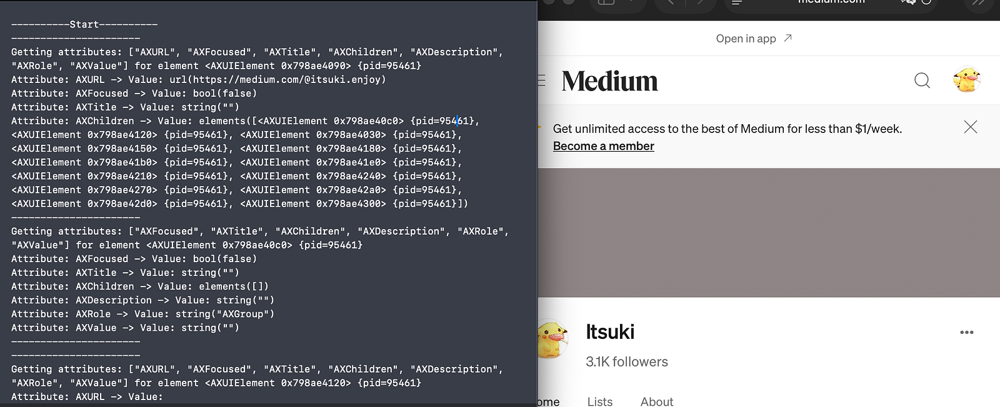

# Swift_MacOS_AvailableInfoWithAccessibilityAPI
A simple demo for getting Available Information With Accessibility API by traversing (either from top level application, or bottom up from the focused UI).

for more details, please refer to my bloc [SwiftUI/MacOS: Content Scrapping With AccessibilityAPI](https://medium.com/@itsuki.enjoy/swiftui-macos-contents-scrapping-with-accessibilityapi-c7e39daf2b19).

